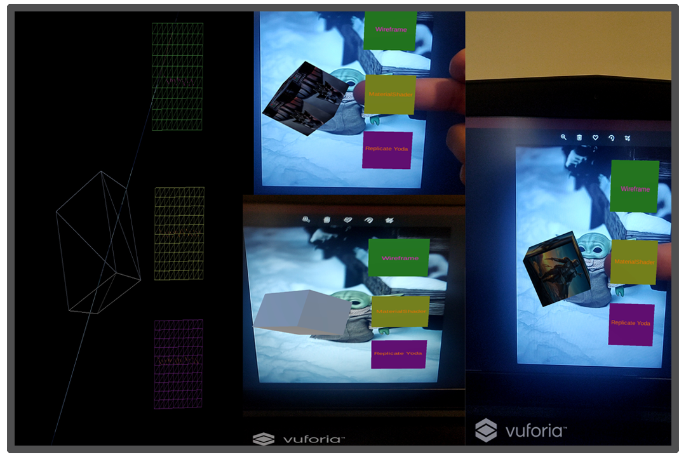

# Multiple-Virtual-Button-AR-Vuforia-Unity

# Link : 
https://drive.google.com/drive/folders/1isq1dRyUEu2ECCc32fXgdwheL_0eTo1D?usp=sharing

* Link contains the game project.
* Video preview of the game.

# Screenshot : 

# Multiple-Virtual-Button-AR-Vuforia-Unity
* Just an Application which depicts the use fo virtual button in an AR application.
* It enables various functionalities.

# Aim
* To create an application which shows the use of virtual buttons.

# How to use the app.
* Either build the application from the unity build manager
* You can also install the application given with this repository.
* Scan the given pictures or target images from your phone and Enjoy.

# System Requirements
* Windows 10 pro
* Unity 2018(LTS)
* Visual Studios 17 or above
* Core i5 processors 7th gen or above.
* Dedicated GPU (Nvidia or AMD) Recomended.

# Getting Started
* Start by downloading the project from given link at the top.
* Unity 2018 with (LTS) recomended or above.
* Start by opening Unity Engine and install the Vuforia Package from the package manager in the Unity application.

* Visual Studio 2019 or 2019 is recommended, It is made to run on Windows OS (8,10).
* Unity 2018(LTS) is recomended.
* Basics of C# language.

# More features to come 
* More fucntionalities to the Marker and Buttons.
* More animated objects.

